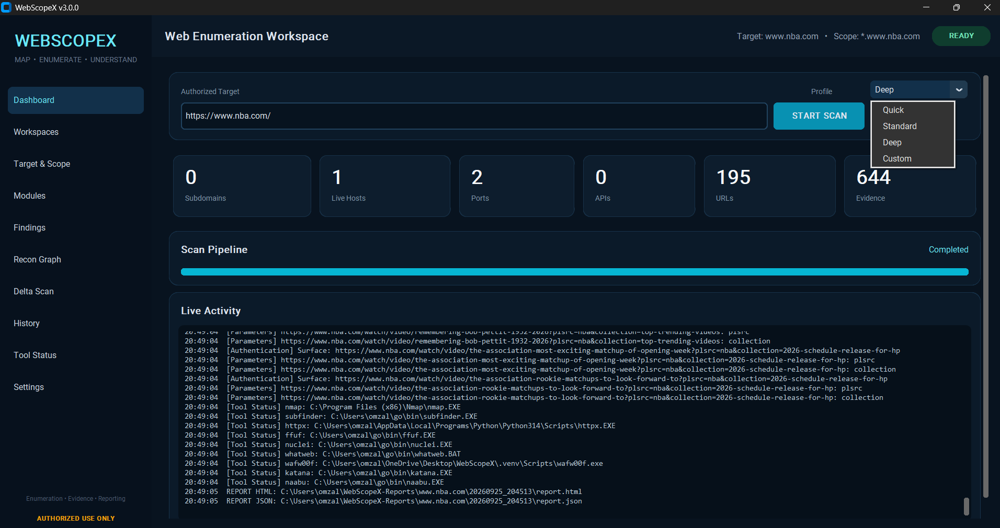
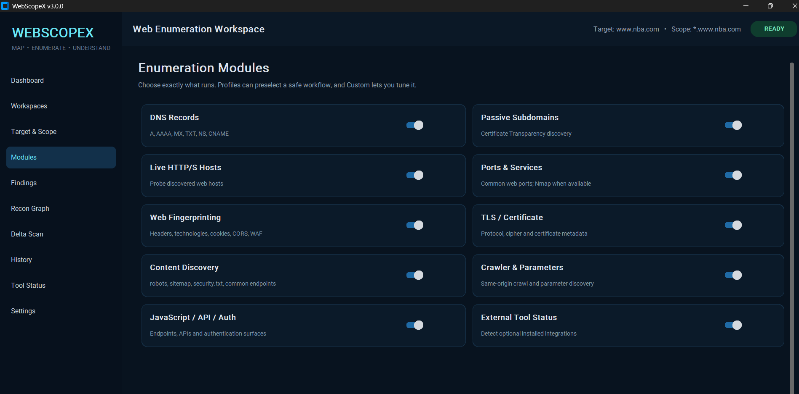
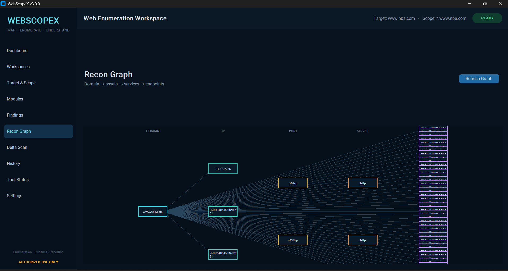
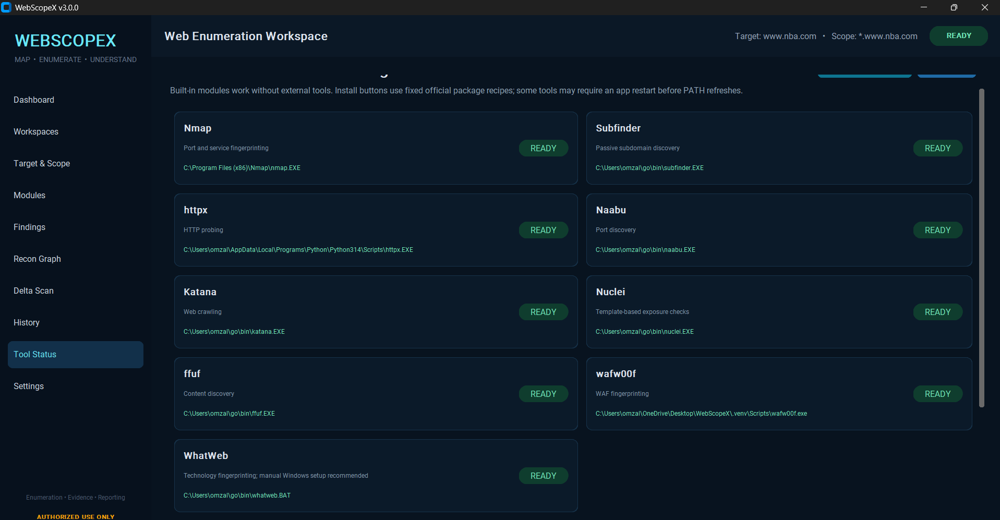

# WebScopeX v3.0

**Map. Enumerate. Understand.**

Windows-first web reconnaissance and enumeration workspace for **authorized security assessments**. WebScopeX combines a richer asset graph, scan-to-scan delta tracking, persistent workspaces, searchable findings, a redesigned report, an external-tool manager, full CLI mode, and a GitHub-ready repository layout.



## Interface Preview

### Dashboard


### Enumeration Modules


### Recon Graph


### Tool Status


## Highlights

- **Recon Graph** — domain → subdomain → IP → port → service, plus host → endpoint relationships.
- **Delta Scan** — compare the current scan with the previous completed scan for the same target.
- **Workspaces** — save named targets, scope roots, and notes in SQLite.
- **Findings view** — live search, module filter, severity filter, and CSV export.
- **GitHub-quality report** — responsive HTML report with summary cards, graph inventory, searchable/filterable evidence table, JSON and graph exports.
- **Tool Installer / Status Manager** — detects optional integrations and offers fixed install recipes for supported Windows tools.
- **CLI mode** — Quick / Standard / Deep / Custom module execution without the GUI.
- **Scope Guard** — redirects and requests outside the declared scope root are skipped.
- **Persistent history** — scan metadata and workspaces are stored locally in SQLite.

## Built-in enumeration modules

DNS records, passive Certificate Transparency subdomains, live HTTP/S probing, common web port/service enumeration, headers, technologies, cookies, CORS, WAF heuristics, TLS metadata, robots/sitemap/security.txt, common content discovery, same-origin crawling, parameter discovery, JavaScript endpoint extraction, API discovery, authentication-surface mapping, and external-tool status.

## Windows quick start

1. Extract the release ZIP.
2. Double-click `INSTALL.bat` or run it from Command Prompt.
3. First launch: `RUN_WEBSCOPEX_DEBUG.bat`.
4. After validation, use `RUN_WEBSCOPEX.bat` or the Desktop shortcut.
5. Enter a target and scope that you own or are explicitly authorized to assess.

The installer creates an isolated `.venv`, installs Python dependencies, validates the source, and creates GUI/CLI launchers.

## CLI

CLI execution requires an explicit authorization confirmation flag:

```bat
RUN_WEBSCOPEX_CLI.bat example.com Standard
```

Equivalent direct command:

```bat
.venv\Scripts\python.exe webscopex.py --cli --authorized --target example.com --profile Standard
```

Choose individual modules:

```bat
.venv\Scripts\python.exe webscopex.py --cli --authorized --target example.com --modules dns,subdomains,live,headers,tls
```

List modules or integrations:

```bat
.venv\Scripts\python.exe webscopex.py --list-modules
.venv\Scripts\python.exe webscopex.py --list-tools
```

## Output

Default location:

```text
%USERPROFILE%\WebScopeX-Reports\<target>\<timestamp>\
```

Each scan writes:

- `report.html` — responsive local report
- `report.json` — complete machine-readable evidence
- `graph.json` — asset graph nodes and relations

## Repository map

```text
WebScopeX/
├─ webscopex.py
├─ INSTALL.bat
├─ INSTALL_DEBUG.bat
├─ RUN_WEBSCOPEX.bat
├─ RUN_WEBSCOPEX_DEBUG.bat
├─ RUN_WEBSCOPEX_CLI.bat
├─ requirements.txt
├─ pyproject.toml
├─ docs/
│  ├─ ARCHITECTURE.md
│  ├─ CLI.md
│  ├─ REPORTS.md
│  ├─ TOOLS.md
│  └─ screenshots/
│     ├─ dashboard.png
│     ├─ modules.png
│     ├─ recon-graph.png
│     └─ tool-status.png
├─ tests/
├─ LICENSE
├─ CONTRIBUTING.md
├─ SECURITY.md
├─ CHANGELOG.md
└─ .gitignore
```

## Safety / scope

Use WebScopeX only on systems you own or have explicit authorization to test. The scope guard reduces accidental traversal outside the declared domain boundary, but it does not replace written permission or a defined rules-of-engagement document.

## Disclaimer

WebScopeX is provided strictly for **educational, defensive, and authorized security assessment purposes**.

You must only use this software on systems, applications, networks, or assets that you own or for which you have explicit permission to test. You are responsible for understanding and following all applicable laws, rules of engagement, bug-bounty program policies, and organizational requirements.

The authors and contributors are not responsible for misuse, unauthorized testing, service disruption, data loss, legal consequences, or other damage resulting from use of this software.

WebScopeX is provided **"as is"**, without warranties of any kind. Always test carefully, respect scope boundaries, and obtain written authorization where appropriate.
